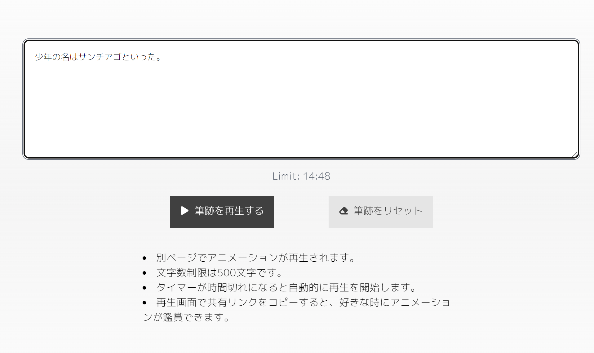
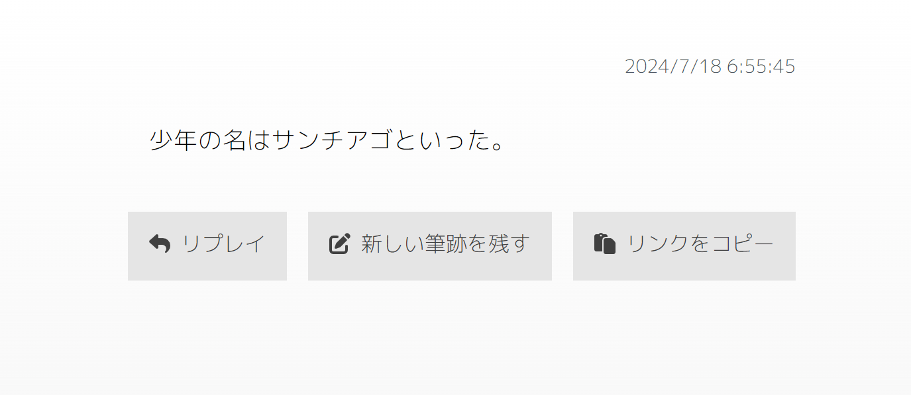

## ■ サービス名

## サービス概要

「Hisseki」は、ユーザーが入力したテキストの編集履歴を記録し、再生することができるアプリです。
文章作成のプロセスをトレースすることで、ユーザーの言葉以前の思考の流れやアイデアの変遷を目に見える形で表現します。

## このサービスへの思い・作りたい理由

私は読書が好きで、古今東西の本や思想に触れて物思いにふけるのを趣味としています。
多くの名著に触発され、私自身小説を書こうとしたこともありました。
ですが、物書きの経験のない素人がいきなり名作を生み出せるほど文筆の世界は甘くありません。

しかし、頭を悩ませて綴った言葉が稚拙なものだったとしても、
自身の混沌とした思考や感情に形を与え、悩みながらもそれを文脈に落とし込む過程には、
最終的に綴られる文章と同様、刮目すべき物語を見出せると思うのです。
こうした物語は、ライターや文筆家に限らず、世の中で文章を残す全ての人が持っているものです。

こういった文章に込められた十人十色な成り立ちを視覚化することで、
頭を悩ませずとも、物書き顔負けの趣深い文章が残せるのではないか？
そういった思いでこのアプリを開発しました。

## ユーザー層について

小説や詩といった文筆を嗜む人 
日記を記す習慣がある人 
生活の中で何らかの文章を残す習慣がある人

## リンク共有機能

アプリで入力したテキストは、リンク共有ボタンを押下することでデータベースに保存されます。 
利用に際してユーザー登録等は一切必要なく、気軽に使用することが可能です。

## MVPリリース

テキスト入力時のレコードリセット機能 
・テキスト再生時のリプレイ機能

## 本リリース

テキスト再生時のリンク共有機能

## 使い方

1.textareaに任意の文章を入力し、「筆跡を再生する」ボタンを押下。

2.再生画面でテキストを鑑賞する。

「リプレイ」ボタンで再度テキストを再生、 
「新しい筆跡を残す」ボタンでテキスト入力画面に遷移、 
「リンクをコピー」ボタンでDBに保存・共有リンク発行に分岐する 

## 今後の開発について
### ダークモードの実装
全体的に白を基調としたデザインになっているため、ユーザビリティ確保のためには必須と考えています。

### テキスト再生時の視覚効果の追加
本アプリはテキスト入力の過程を再生するという大変シンプルな構成のため、UX上昇のためにさらなる機能追加を検討しています。 
具体的には、各単語の入力までに要した時間を参照して、「言葉の重み」を視覚的に表現する、 
言葉に含まれているであろう感情を予測し、フォントカラーの変化によってそれを表現する、といったものです。

### テストコードの実装
テストコードが書けていないので、バグやエラーを早期発見できるように努めたいです。 
追加機能をデプロイした際、他の機能が動作しないといった事態を防止したいと考えています。

### データベースの容量確保
ユーザーが入力した文章の差分を全て記録する問題で、利用者一人当たりのデータベースにかかる圧迫量がかなり大きいです。 
リンク共有機能を利用しなければDBへのPOSTは発生しませんが、なんとか圧迫を減らす手段を見つけたいと考えています。

## ■ 使用技術

| カテゴリー     | 使用技術                     |
| :------------- | :--------------------------- |
| フロントエンド | TypeScript 5.4.5 Next.js 14.2.5 React 18.3.1 TailwindCSS|
| バックエンド   | API route (Next.js)     |
| インフラ       | Vercel             |
| DB             | supabase                   |
| ライブラリ            | google/diff-match-patch  |